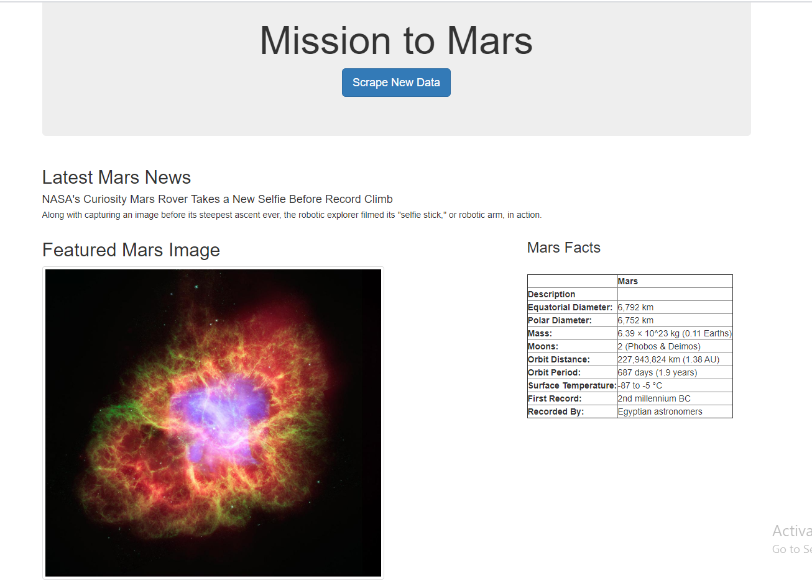

# Mission-to-Mars
## Project Overview
A Webscraping Project requires us to scrape the information of Mars from various website and show the consolidated information on a new webpage . In order to acheive this task we need to do the following steps:
1.	Use the Splinters, BeautifulSoup and Padas to scrape (gather) information from different website
2.	We use the MongoDB to store the consolidate the information. 
3.	The MongoDB is then connected via Flask application to show the Mars information in the web browser.
4.  The HTML template is used to show the Mars infomation in a neat manner.
## Resources
- Data Source: 
1. Mars News and Title : (https://mars.nasa.gov/news/).
2. Featured Image : (https://www.jpl.nasa.gov/spaceimages/?search=&category=Mars)
3. Mars Facts : (https://space-facts.com/mars/)
4. Mars Hemisphere : (https://astrogeology.usgs.gov/search/results?q=hemisphere+enhanced&k1=target&v1=Mars)
- Software: Splinter, BeautifulSoup, Pandas, Python, MongoDb, Flask and Html.
 ## WebScraped website :
The Mission to Mars website now has the real time data such as Mars News and Title,Featured Image and Mars fact. It also provides the user with an option to retrieve the real time data using the "Scrape New Data" 
 
## Challenge Overview
The challenge's objective was to scrape the Mars Hemisphere information from the website mentioned via same methodologies.
The python file scraping.py retrieve the requested information from when the user clicks the "Scrape New Data". The flask app.py creates the appropriate route to retrieve the data from the MongoDB and display it on the webpage using the index.html template.
## Challenge Summary
The webpage now displays the Mars hemisphere images and their respective title along with other Mars information.

